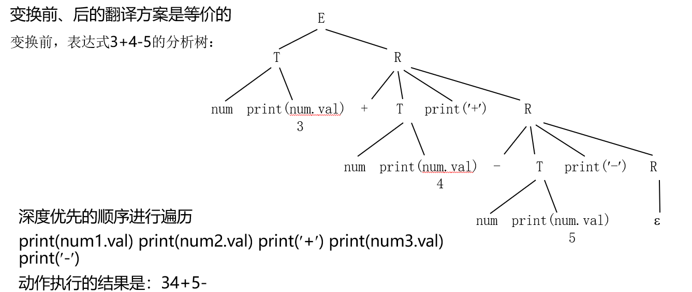
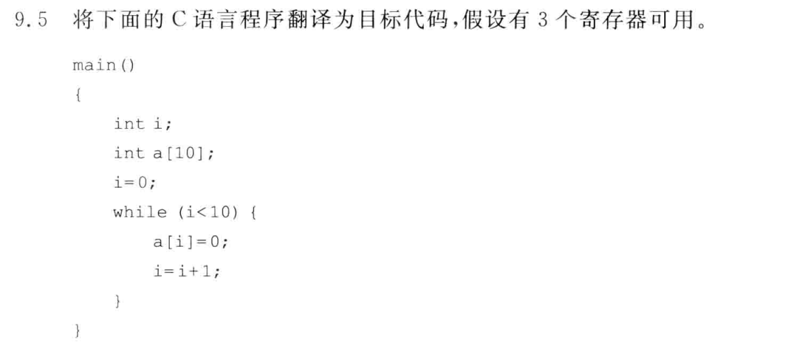

# 2022年编译原理\_期末真题_回忆版

> 【author】Maxpicca-Li
>
> 【写在前面】
>
> 1. 考试时间：2022年6月2日16:30~18:30。
>
> 2. 记录时间：2022年6月9日18:20
>
> 2. 离考试已经好几天过去了，复习不进去嵌入式，来写写。开卷的话，我们这一届书比PPT好使，还可以配备一下那本习题分析，感觉都不需要打印PPT（可怜我的打印钱钱），总结好题型，B站上都有相关视频，还是挺简单的（但愿我别挂，要不然就很尴尬😅）。
>
> 2. 计院专业课的试卷似乎都不准老师发出来, 希望有学弟学妹们能将我”回 忆试卷”的习惯传承下去! 
>    ——from VayneDuan
>
> 5. 其余专业课的回忆版试卷如下：记得 star & follow, 会持续更新的!
>
>    Source：[VayneDuan/cqu-cs-learning-materials](https://github.com/VayneDuan/cqu-cs-learning-materials)
>
>    Fork：[Maxpicca-Li/cqu-cs-learning-materials](https://github.com/Maxpicca-Li/cqu-cs-learning-materials)
>
> 
——【写在前面】基于原作者VayneDuan修改

## 简答题

都比较简单，都能在书上找得到，只记一些记得的

1. 多编编译程序的概念及其优点
2. 什么是LL1文法

## 综合体

1. 对文法消除左递归，提取左公因子后，求FIRST和FOLLOW集合
2. 给定一个文法，判断是否是SLR文法
3. 给定一段翻译方案，写通过语法分析、语义分析后的结果，形如
   
4. 给定一段代码，翻译为目标代码，形如
   

## 分析题

给定华为方舟编译器的背景，分析中间代码的好处与作用，分析编译程序和解释程序的异同、优缺点等。

