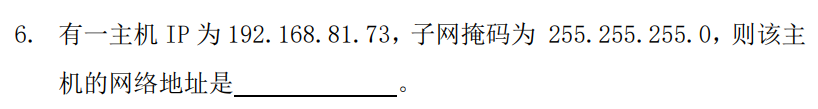

# 2021年计算机网络\_期末真题_回忆版

> 【author】Maxpicca-Li
>
> 【写在前面】
>
> 1. 考试时间：2021年12月23日14:00~16:00
>
> 2. 试卷有个别毒瘤（没背住），多刷往年真题！！！（没有答案也要刷）
>
> 3. 本回忆版真题于2021年12月23日16点07分写成, 因为考崩了
>
> 4. 计院专业课的试卷似乎都不准老师发出来, 希望有学弟学妹们能将我”回 忆试卷”的习惯传承下去! 
>    ——from VayneDuan
>    
> 5. 其余专业课的回忆版试卷如下：记得 star & follow, 会持续更新的!
>    
>    Source：[VayneDuan/cqu-cs-learning-materials](https://github.com/VayneDuan/cqu-cs-learning-materials)
>    
>    Fork：[Maxpicca-Li/cqu-cs-learning-materials](https://github.com/Maxpicca-Li/cqu-cs-learning-materials)
>
> 
——【写在前面】基于原作者VayneDuan修改

## 选择题

1. 物理层、数据链路层、网络层的数据单位

2. 协议和服务概念判断

3. 采样量256，带宽64Mbps，求最大数据传输速率W _MHz_：

   奈式定理：
   $$
   2\times W \times \log_2(256)=64Mbps\\W=8MHz
   $$

4. 。。。

5. ADSL的多路复用机制：频分

6. PPP协议

7. TCP、UDP、IP数据包首部校验问题

8. CIDR ip地址聚合 （往年现题）

9. 。。。

10. 类似于"http://www.cqu.edu.cn/index"求域名：www.cqu.edu.cn

    > 具体网址忘记了，问题不大

## 填空题

1. 脉冲编码调制技术的三个步骤：采样、**量化**、编码

2. 海明码校验11位数据信息，需要 **4** 位校验位

3. 。。。

4. 类似于这个

   

5. 。。。

6. TCP，建立连接 **三次握手** ，释放连接 **四次挥手**

7. BGP协议的工作的层次为 **传输层**

8. 网桥通过**生成树**算法来避免环路

9. DNS的查询方式有**迭代和递归**查询

## 简答题

1. 协议定义和协议三要素（2019-2020-1A）

2. 物理接口的四个特性以及**举例**（2019-2020-1A）

   > 举例这个有点扯（呜呜呜，复习的时候没背住）

3. 数据链路层如何实现点对点的速度匹配和可靠性传输的？

4. 以太网传输时间计算

   >  （貌似很难，呜呜呜，考前1h群里有人在问，我没具体关注）
   >
   > 据说是这样的：
   >
   > 
   >
   > LYW`LGM0`7MZ8H.jpg)

5. UDP和IP都是无连接的不可靠传输，那可不可以去掉UDP层，直接让IP层为应用层提供服务？

6. 电子邮件的四个传输协议及其实现的作用：（MIME, SMTP，POP3，IMAP）

   > （呜呜呜，复习的时候没背住）

## 综合题

1. RIP

   1. RIP的路由算法及其算法原理（距离-向量算法）
   2. RIP路由表更新过程

2. TCP

   1. 快恢复和快重传的原理
   2. 拥塞窗口的变化

   类似于这道题：

   

